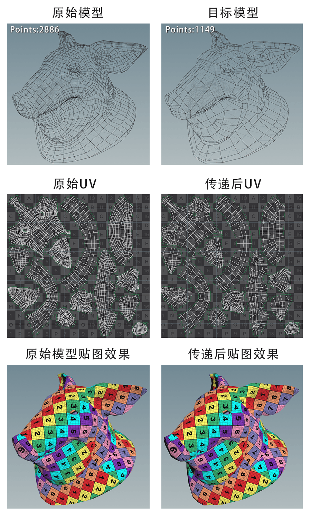
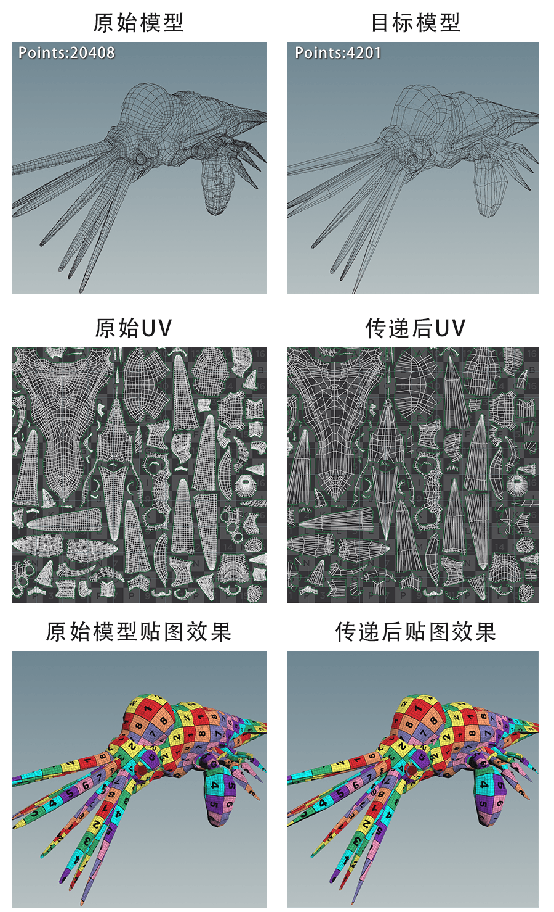
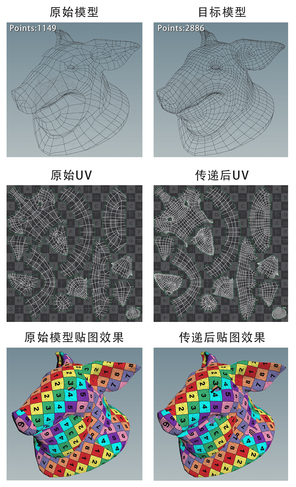
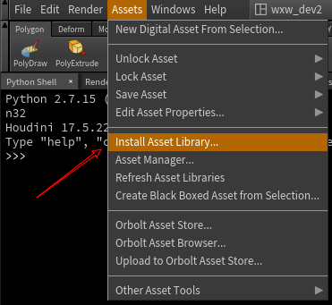
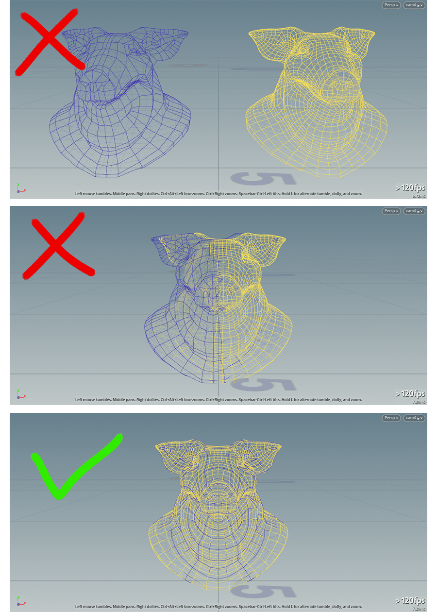
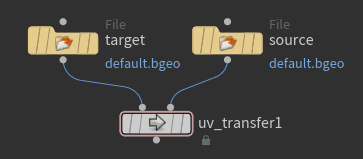

不同拓扑结构模型之间UV的传递一直是个问题。如果两个模型点或边不一样传递uv时大多数软件会失败。Houdini用attribute transfer能应付部分情况但如果模型差的比较多，UV的边界也会出问题。

因为以前的一个项目需要，做过一个小工具解决这个问题，在当时项目上效果还不错，先看下效果。

猪头模型的点数量相差60%，章鱼的数量相差80%。

#### 例子1：

#### 例子2：

同样支持从低精模型到高精模型的传递。有时这个方法可以用做低精模型给高精模型分UV的工具。

## 使用方法

用法非常简单只是一个houdini的digital asset。

1.下载：
   1. 百度云：https://pan.baidu.com/s/1k210Q3juuJ9MPki_3KUXHg
   2. Github：https://github.com/bbrcnx/uv_transfer

2.安装下载的Asset文件。

3.安装完成后在sop界面下创建uv_transfer节点。

4.最关键的一步：将原始模型和目标模型尽量对齐。

两个模型的对齐程度决定了转换效果。所以特别适用于在位置不变的情况下高模变低模或低模升高模后的uv传递。

如果两个模型原始的位置差的多，想要达到比较好的效果就需要多花些时间对齐模型。手动对齐效果有时不会太理想。

5.将原始模型连到右侧输入端，目标模型连到左侧输入端就OK了。Asset没提供可调参数，因为默认参数能应付绝大多数情况。如果你需要调整可进到asset内自行修改。

## 原理
工具的原理是根据两个模型的空间距离传递uv属性，谁离得近就传给谁，所以对齐特别重要。工具核心也是`attribute_transfer`节点，区别于简单的`attribute_transfer`它根据uv的连接把模型分成不同的块，先传递分块信息，然后再根据两个模型对应的块，一块一块传递uv，这就避免了不同uv边界出错的问题。

